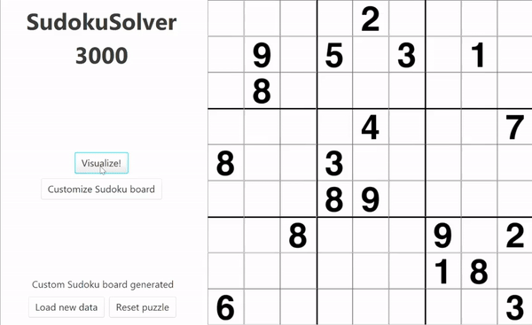
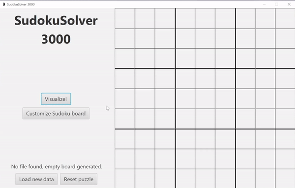

# SudokuSolver 3000
A pure Java + JavaFX application that visualizes the backtracking algorithm
solving a Sudoku board.

## Customization
Enter numbers for each cell, paste a Sudoku board in plain text, or randomize
how many numbers there are on the board.

## How to run
Download the SudokuSolver.jar file to run. Make sure to install Java Runtime
Environment to run Java package files.

## Technology & Implementation
**JavaFX** for the Graphical User Interface (GUI).

**Pure Java** for backtracking algorithm.

The project implements the **MVC** design pattern for front-end and back-end
communication.

## Motivation
I built the GUI using JavaFX in code (not SceneBuilder) because I learned MVC
in a class during the first year at RIT. I enjoyed laying out all the different
nodes for the interface with just code. In a way, it's challenging yet fun .
But, I do want to try SceneBuilder some time in the future as well.

This project would not have been very interesting without the backtracking
algorithm solving the Sudoku board and threads to update the front-end while
the back-end solves the puzzle. Again, all the motivation are from topics
that I have taken in that class I mentioned.

These kinds of project that combine a variety of concepts that I learned
in class, are beneficial to me as they are a way I apply my knowledge.

## What's next?
As of now, the application can only be run as an executable Java package
file. Some time soon, I want to make the application available on a website.
